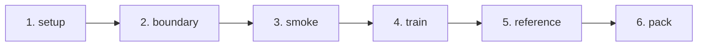

# 학습 파이프라인 및 설정 상세

이 문서는 RunPod 환경 준비부터 학습 스크립트(`run_train.sh`)의 동작 단계, 하이퍼파라미터 설계 근거 및 모니터링 방법을 다룹니다.

---

## 1. RunPod 인스턴스 사양 가이드

| 구성 요소 | 권장 사양 | 설정 근거 |
| :--- | :--- | :--- |
| **GPU** | **80GB VRAM 1장** (A100 SXM4 80GB 또는 H100 NVL/SXM) | 31B 파라미터 모델 4-bit 양자화 + 최대 8.4k 토큰 역전파 메모리 확보 |
| **템플릿** | RunPod PyTorch 공식 템플릿 | CUDA 드라이버 및 PyTorch 기본 내장 (`requirements.txt`에 torch 미포함) |
| **Container Disk (`/root`)** | **80GB 이상** (vLLM 사용 시 100GB) | 모델 캐시 가중치(~62GB) 및 vLLM 가상환경(~10GB) 저장 공간 |
| **Volume (`/workspace`)** | **30GB 이상** | 코드, 데이터셋, 학습 체크포인트 및 결과 파일 보관 |
| **CUDA 드라이버** | CUDA 13.0 이상 권장 (vLLM 사용 시 필수) | vLLM 0.29.0 wheel의 cu130 의존성 충족 |
| **환경 변수** | `HF_TOKEN=hf_...` (선택/권장) | Hugging Face 모델 다운로드 속도 향상 및 Hub 백업 시 필수 |

---

## 2. 학습 실행 명령 (`run_train.sh`)

모든 명령은 RunPod의 `/workspace/ugrp` 디렉토리에서 실행합니다.

```bash
# 기본 전체 파이프라인 실행 (tmux 백그라운드 세션 ugrp-train 에서 실행)
bash scripts/run_train.sh --detach

# 특정 단계부터 재실행 (예: train 단계부터)
bash scripts/run_train.sh --detach --from train

# 중단된 마지막 체크포인트에서 학습 이어서 진행
bash scripts/run_train.sh --detach --from train --resume

# 학습 완료 후 Hugging Face Private Repository로 어댑터 백업
PUSH_TO_HUB=my-org/my-gemma-adapter bash scripts/run_train.sh --detach
```

---

## 3. 학습 단계별 파이프라인

`run_train.sh`는 6단계로 순차 실행되며, 단계별 완료 상태는 `logs/STATE`에 기록됩니다.



| 단계 | 실행 스크립트 / 모듈 | 입력 및 동작 | 예상 소요 | 실패 시 대응 |
| :--- | :--- | :--- | :-: | :--- |
| **1. setup** | `scripts/pod_setup.sh` | VRAM, 디스크 공간 점검 → pip 패키지 설치 → 베이스 모델 다운로드 | 수 분 | 디스크 증설 또는 `HF_TOKEN` 설정 |
| **2. boundary** | `ugrp.training.check_boundary` | **미세조정 전 베이스 모델**로 valid 1번 샘플 생성. 출력 태그 형식(`<\|channel>thought\n`, `<channel\|><turn\|>`) 일치 여부 확인 | 5~10분 | `[MISMATCH]` 발생 시 태그 규격 대조 (Troubleshooting 참조) |
| **3. smoke** | `train --max-steps 3 --limit 4 --longest` | 가장 긴 4개 샘플로 3 스텝 테스트 학습 진행. VRAM 피크(`peak_vram_gb`) 확인 | 5~10분 | VRAM 부족 시 본 학습 진입 전 조기 중단 |
| **4. train** | `ugrp.training.train` | `SFT_think_en_train_gemma4.jsonl` 기반 QLoRA 학습 진행 (185 스텝) | 약 4시간 | `--from train --resume`으로 이어서 재개 |
| **5. reference** | `ugrp.inference.parity_reference` | 학습 샘플 2건에 대한 NLL 손실 측정 및 **형식 학습 게이지** 산출 (`parity_reference.json`) | 수 분 | 실패해도 중단되지 않음 (추후 수동 실행 가능) |
| **6. pack** | `scripts/pack_results.sh` | 어댑터 가중치, 메트릭, 로그, 결과 파일 압축 → `results_{번들ID}.tar.gz` | 수 분 | `--from pack`으로 재압축 가능 |

---

## 4. 하이퍼파라미터 및 학습 설정 근거

설정의 단일 출처는 [`configs/base.yaml`](../configs/base.yaml)입니다.

### 4.1 양자화 및 LoRA 구조
- **베이스 모델**: `google/gemma-4-31B-it`
- **양자화**: BitsAndBytes 4-bit NF4, Double Quantization, Compute dtype `bfloat16`
  - *(참고)* 4-bit 베이스 모델 가중치에 LoRA를 직접 병합(merge)하면 정밀도 손실이 심하므로 병합하지 않고 어댑터 형태로 서빙합니다.
- **LoRA 파라미터**:
  - `r = 16`, `alpha = 32`, `dropout = 0.05`
  - 대상 모듈: 언어 모델의 7개 선형 레이어 (`q_proj`, `k_proj`, `v_proj`, `o_proj`, `gate_proj`, `up_proj`, `down_proj`). Vision tower는 제외.

### 4.2 최적화 및 스케줄러
- **배치 및 누적**: Per-device batch size 1 × Gradient Accumulation **4**
- **학습률**: `lr = 2e-4`, Cosine decay, Warmup 5% (10 steps)
- **옵티마이저**: `paged_adamw_8bit`, Gradient clipping `1.0`
- **에포크 및 스텝**: 5 에포크 = **총 185 스텝** (148건 데이터 ÷ 누적 4 = 에포크당 37 스텝)
  - *(설정 근거)* 2차 학습(Gradient Accumulation 16, 총 30스텝) 당시 업데이트 횟수 부족으로 사고 형식을 완전히 체득하지 못한 문제가 발생하여, 3차 설정에서는 가중치 업데이트 횟수를 6배로 확대했습니다 ([issue/0927/0927_settings_lora.md](../issue/0927/0927_settings_lora.md)).

### 4.3 손실 함수 및 데이터 처리
- **Completion-only Loss**: 프롬프트 부분은 마스킹하고, 사고 과정(`<\|channel>thought\n...<channel\|>`)과 완성 지문에 대해서만 Cross-Entropy Loss를 계산합니다 (`completion_only_loss=True`).
- **최대 길이 (`max_len: 10240`)**: 토큰 수가 10,240을 초과하는 극단 샘플은 중간을 자르지 않고 필터링하여 문맥 단절을 방지합니다.
- **체크포인트 보존**: 5개 에포크 체크포인트(`checkpoint-37/74/111/148/185`)를 모두 보존하여 에포크별 성능 추이를 비교할 수 있도록 합니다.
- **Eval Loss 미측정 사유**: 검증 및 평가 데이터에는 정답 사고 과정이 없으므로 단순 `eval_loss`를 측정할 수 없습니다. 대신 체크포인트별 추론 생성 결과와 복사율 지표를 통해 과적합을 정밀 평가합니다.

---

## 5. Parity Reference 및 형식 학습 게이지

`ugrp.inference.parity_reference`는 학습 완료 후 모델의 형식 학습 상태를 정량 평가합니다:
1. **vLLM Parity 기준값**: 학습 데이터 2건에 대한 HF 4-bit 베이스와 어댑터의 평균 NLL을 측정하여 `parity_reference.json`에 저장합니다. 추후 vLLM 환경에서 LoRA 가중치가 올바르게 마운트되었는지 검증하는 기준선이 됩니다.
2. **형식 학습 게이지**:
   - 사고 과정 첫 단어인 `Task` 토큰의 예측 확률을 측정합니다.
   - **판정 기준**: 확률이 0.5 미만이면 모델이 규격화된 사고 개시 형식을 충분히 학습하지 못한 것으로 간주합니다. (2차 학습 당시 0.025로 낮게 측정된 바 있음)

---

## 6. 진행 상황 모니터링

`run_train.sh --detach`는 `tmux` 세션 내에서 안전하게 백그라운드로 실행됩니다.

```bash
# 1. 실시간 로그 확인 (Ctrl+C를 눌러 빠져나와도 백그라운드 학습은 계속됨)
tail -f logs/ugrp-train.log

# 2. 현재 완료된 단계 및 소요 시간 확인
cat logs/STATE

# 3. 실행 중인 tmux 세션 직접 접속 (빠져나올 때: Ctrl+B 누른 후 D)
tmux attach -t ugrp-train
# ⚠️ 주의: tmux 세션 내에서 Ctrl+C를 누르면 학습 프로세스가 강제 종료됩니다!
```

